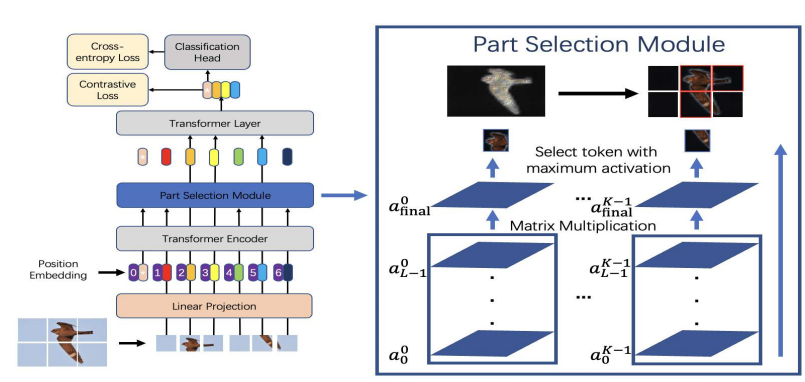
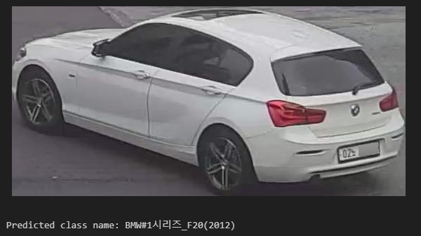
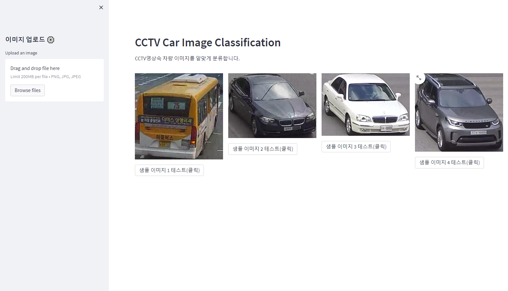
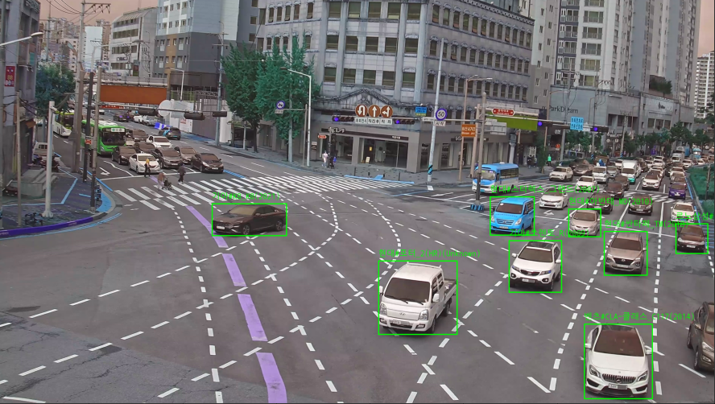

# TransFG: A Transformer Architecture for Fine-grained Recognition


본 레포지토리는 CCTV영상의 차량 이미지 분류에 특화된 TransFG 모델의 학습 및 추론 코드를 제공합니다.  
원본 코드는 [TransFG](https://github.com/TACJu/TransFG)임을 밝힙니다.
사용자를 위한 AI 모델, 저작권 및 라이센스 세부 정보를 제공합니다.

[](https://paperswithcode.com/sota/fine-grained-image-classification-on-cub-200?p=transfg-a-transformer-architecture-for-fine) [](https://paperswithcode.com/sota/fine-grained-image-classification-on-nabirds?p=transfg-a-transformer-architecture-for-fine) [](https://paperswithcode.com/sota/fine-grained-image-classification-on-stanford-1?p=transfg-a-transformer-architecture-for-fine) [](https://paperswithcode.com/sota/image-classification-on-inaturalist?p=transfg-a-transformer-architecture-for-fine)

Official PyTorch code for the paper:  [*TransFG: A Transformer Architecture for Fine-grained Recognition (AAAI2022)*](https://arxiv.org/abs/2103.07976)  

## 모델 정보:

TransFG는 "Transformer in Fine-Grained Recognition"의 약자로, 컴퓨터 비전 분야에서 미세한 차이를 구분하는 데 특화된 딥러닝 분류 모델입니다. 

주로 세밀한 특징이 중요한 영역에서 사용되며, 예를 들어 동일한 범주 내에서 매우 유사한 객체들을 구분하는 작업에 효과적입니다

본 모델은 180만장, 400종류 이상의 차량 이미지를 학습하여 90% 이상의 f1-score를 달성했습니다.




## 프레임워크 정보: 

+ Python 3.7.3
+ PyTorch 1.5.1
+ torchvision 1.8.2+cu111
+ ml_collections

## 파인튜닝 데이터에 대한 설명:

본 레포지토리에서 제공하는 모델은 CCTV 기반의 차량정보 및 교통정보 계측 데이터로 파인튜닝 되었습니다.

데이터는 이미지(jpg)와 해당 이미지의 라벨링파일(json)로 구성되어 있습니다. 
각 이미지 내 차량에 대해서는 bounding box 좌표와 차량의 모델명이 포함된 라벨링 정보가 제공됩니다. 

데이터는 [ai허브](https://aihub.or.kr/aihubdata/data/view.do?currMenu=&topMenu=&aihubDataSe=data&dataSetSn=71573)에서 다운로드 받을 수 있습니다.

## 환경 설정
### 1. packages 설치

Install dependencies with the following command:

```bash
pip3 install -r requirements.txt
```

### 2. (학습 시)데이터 셋 준비 (이미지(JPG), Label(csv))
train_x.csv / val_x.csv 의 형태로 데이터셋을 준비하면 됩니다. 
csv 구성요소 : path / label 

## 훈련 및 추론 코드 사용 가이드

#### 학습 : 단일 GPU를 사용하는 경우:
```bash
CUDA_VISIBLE_DEVICES=0 python3 -m torch.distributed.launch --nproc_per_node=1 train.py --dataset custom --split overlap --num_steps 10000 --fp16 --name sample_run
```
#### 학습 : 다중 GPU를 사용하는 경우(4개 GPU 사용하는 경우)
```bash
CUDA_VISIBLE_DEVICES=0,1,2,3 python3 -m torch.distributed.launch --nproc_per_node=4 train.py --dataset custom --split overlap --num_steps 10000 --fp16 --name sample_run
```

### 추론 
------------------
학습된 모델을 다운받았다면, inference.py, inference_print.ipynb 파일에서 임의의 1개 데이터에 대하여 바로 추론 가능합니다. 

inference.py 사용법 및 예시: python3 inference.py --img_path {이미지 경로}
```bash
python3 inference.py --img_path demo/examples/C-220705_07_CR14_03_A1147_add.jpg
출력 : Predicted class name: BMW#1시리즈_F20(2012)
```

inference.py 사용법 : 코드 내부에서 img_path에 이미지 경로 삽입 후 셀 실행
<br>
 

### 데모 실행
------------------ 
demo 폴더 내 'app.py' 파일을 다음 명령어를 사용하여 실행하면, 웹페이지를 통해 모델을 직접 테스트해 볼 수 있습니다. 
```bash
streamlit run demo/app.py
```
 

## 활용 
TransFG 모델은 yolo 모델과 같은 객체 탐지 모델과 함께 사용하면 효과적입니다.

아래는 yolov5모델로 차량을 탐지한 뒤, TransFG 모델로 각 챠량을 분류한 영상입니다. 회사의 공식 [유튜브 채널](https://www.youtube.com/watch?v=uhDbKFINBic)에서 확인할 수 있습니다. 

 


## Copyright:

MIT License

Copyright (c) 2021 Ju He

Permission is hereby granted, free of charge, to any person obtaining a copy
of this software and associated documentation files (the "Software"), to deal
in the Software without restriction, including without limitation the rights
to use, copy, modify, merge, publish, distribute, sublicense, and/or sell
copies of the Software, and to permit persons to whom the Software is
furnished to do so, subject to the following conditions:

The above copyright notice and this permission notice shall be included in all
copies or substantial portions of the Software.

THE SOFTWARE IS PROVIDED "AS IS", WITHOUT WARRANTY OF ANY KIND, EXPRESS OR
IMPLIED, INCLUDING BUT NOT LIMITED TO THE WARRANTIES OF MERCHANTABILITY,
FITNESS FOR A PARTICULAR PURPOSE AND NONINFRINGEMENT. IN NO EVENT SHALL THE
AUTHORS OR COPYRIGHT HOLDERS BE LIABLE FOR ANY CLAIM, DAMAGES OR OTHER
LIABILITY, WHETHER IN AN ACTION OF CONTRACT, TORT OR OTHERWISE, ARISING FROM,
OUT OF OR IN CONNECTION WITH THE SOFTWARE OR THE USE OR OTHER DEALINGS IN THE
SOFTWARE.
